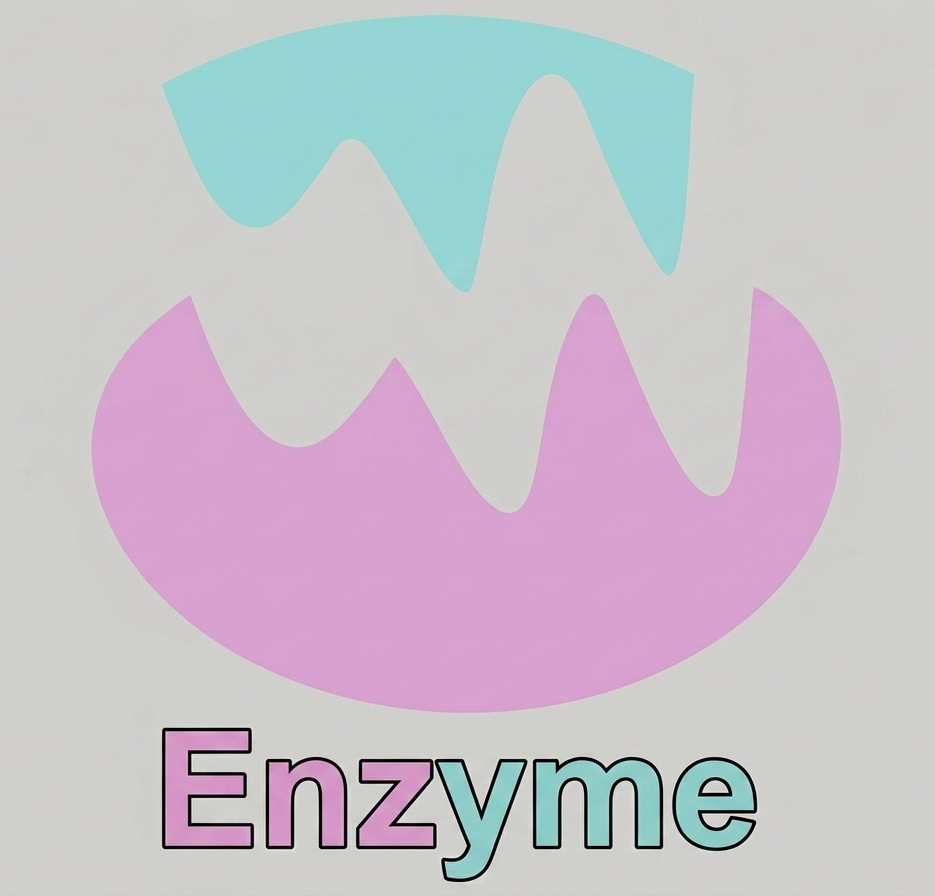

# Enzyme
A lines of code counter as a Roblox Studio plugin

# Functionality

Count lines of code under selected instances (children and descendants), entire DataModel(s), and the current script.

# Installation

Either copy the source code into a script in Roblox Studio and right click -> Save As Local Plugin, or put an .rbxmx file from one of the Releases in your Local Plugins folder in Roblox Studio.

Enzyme is also available as a plugin on the Creator Store, under the same name.
